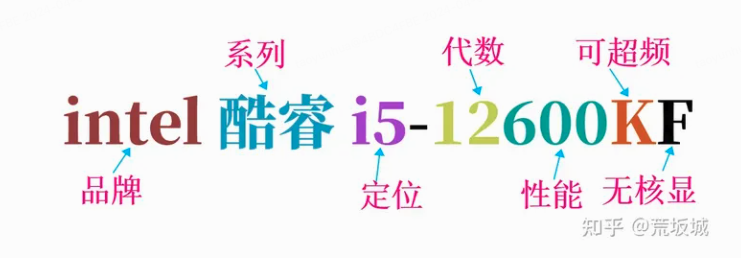
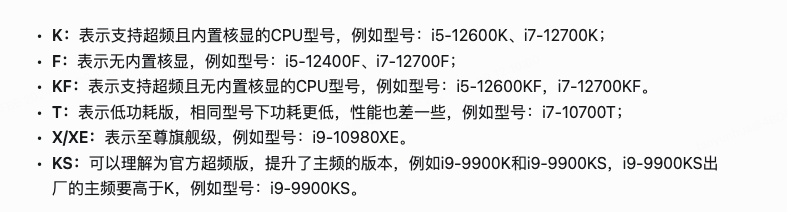
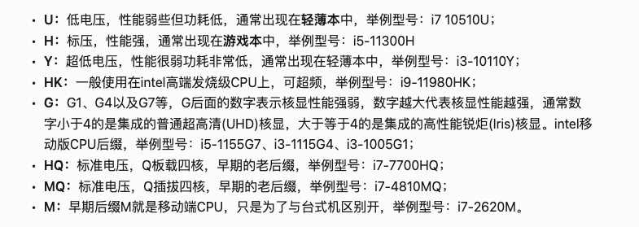
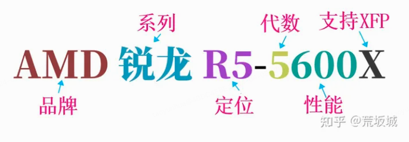
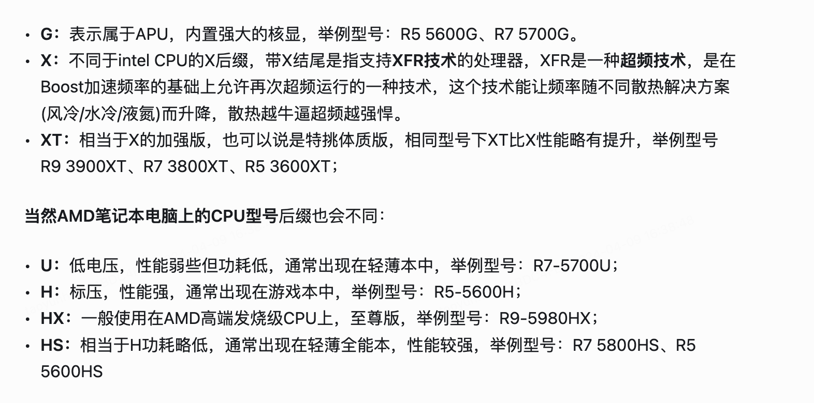

# CPU和主板

## 一、CPU

### 1.品牌

CPU有两大品牌Intel和AMD

### 2.型号

举例说明：

#### Intel

Intel：Intel core i5-12600KF

Intel：品牌名称

core：品牌系列分类，Intel分类有赛扬（Celeron），奔腾（Pentium），酷睿（Core），至强（Xeon），性能依次递增，常见的都是酷睿

i5：CPU等级代号，i5 i7 i9，具体性能强度需要结合后面的12600看

12600： 第12代芯片，23/10/17 已经14代，一般越新越强。600，SKU型号，同一等级内的性能强度，越大代表同一等级内性能越好。 400-600 代表i5,700-800代表i7,900代表i9

KF：CPU后缀，不同的后缀代表CPU有不同的功能，K代表的是能够超频,F代表是非核显，下面是一个后缀列表：

#### AMD

AMD 锐龙 R5 5600X

AMD: 品牌名称

锐龙：品牌系列，有Ryzen（锐龙）、Ryzen Pro（锐龙Pro）、Ryzen Threadripper（锐龙线程撕裂者）、EPYC（霄龙），除了EPYC霄龙隶属于服务器CPU外，Ryzen锐龙系列都是有消费级桌面、移动产品

R5: 代表这款CPU定位中端，在其下面还有R3，在其上面还有R7和R9，同一代中，数字越大，性能越强. 和Intel的i3 i5 i7 i9一样

5600: 第五代，600SKU， 基本同Intel相似

X：CPU特性，X支持超频。

## 二、主板

主板的品牌需要和cpu的品牌相对应，比如Intel的cpu就要买Intel的主板，AMD的就要买AMD的。

