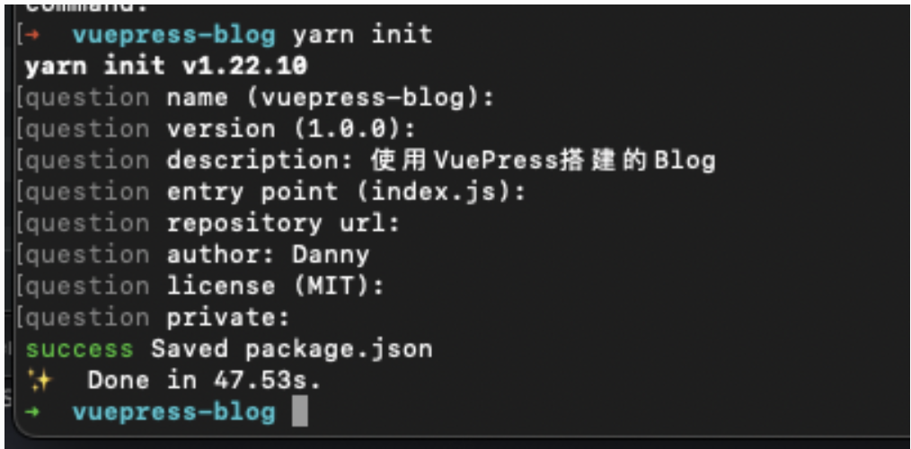
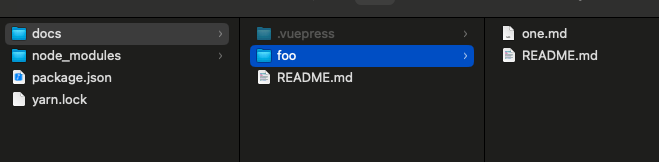
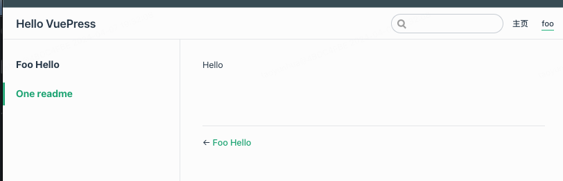

# VuePress 搭建博客

[VuePress官网](https://v1.vuepress.vuejs.org/zh/)

[官方上手文档 1.0](https://v1.vuepress.vuejs.org/zh/guide/)

[参考文章](https://juejin.cn/post/6844904185838698509)

这是很早在逛掘金的时候看到的一篇文章，现在又开始想要搭建博客了，所以翻出来了。

废话不多说，下面是具体的实践步骤（Mac M1）：

## 一、初始化项目

```text

    //1.检查node.js版本  >=8.6
    node -v

    //2.选一个目录创建新目录当做博客项目目录

    mkdir vuepress-blog && cd vuepress-blog

    //3.使用包管理器初始化项目(如果没有yarn，可以通过brew install yarn 安装)
    yarn init

```



```text
// 4.为项目安装vuepress依赖(能挂代理最好挂一下)
yarn add -D vuepress

///5.创建第一篇文档

mkdir docs && echo '# Hello VuePress' > docs/README.md

///6. 在package.json 中添加一些scripts
{
...
  "scripts": {
    "docs:dev": "vuepress dev docs",
    "docs:build": "vuepress build docs"
  }
  ...
}

///7.本地启动服务
yarn docs:dev
打开http://localhost:8080 即可看到页面
```

## 二、基础配置

主要是配置模版

1.依次创建目录和文件 (推荐使用vscode 来打开文件进行后续操作)
docs/.vuepress/config.js

在config.js中放入以下内容

```text
    ///可以设置header 中的titie的数据
    module.exports = {
      title: 'Hello VuePress',
      description: 'Just playing around'
    }
```

2.默认主题
在docs/README.md 中放入以下内容， 会生成官方默认主题: <https://v1.vuepress.vuejs.org/zh/theme/default-theme-config.html#%E5%AF%8C%E6%96%87%E6%9C%AC-footer>。

！注意换行和格式否则可能出错

```text
    ---
    home: true
    heroImage: /hero.png
    heroText: Hero 标题
    tagline: Hero 副标题
    actionText: 快速上手 →
    actionLink: /zh/guide/
    features:
    - title: 简洁至上
      details: 以 Markdown 为中心的项目结构，以最少的配置帮助你专注于写作。
    - title: Vue驱动
      details: 享受 Vue + webpack 的开发体验，在 Markdown 中使用 Vue 组件，同时可以使用 Vue 来开发自定义主题。
    - title: 高性能
      details: VuePress 为每个页面预渲染生成静态的 HTML，同时在页面被加载的时候，将作为 SPA 运行。
    footer: MIT Licensed | Copyright © 2018-present Evan You
    ---
```

3.配置导航栏
在config.js中添加：
并建立对应的目录和文件,
每个导航目录下需要一个README.md（会被编程html入口文件）

```text
    themeConfig:{
      nav: [{text: "主页", link: "/"      },
          { text: "foo", link: "/foo/" }
        ],
    }
```

4.配置侧边栏
./vuepress/config.js中配置

key 为 /foo/ 代表foo导航（目录下）
数组第一个元素代表README.md 的名字，如果是README.md默认则可以使用空字符串代替(每个文件下需要有个README.md文件)，如果是one.md则需要填名称， 第二个元素代表侧边栏标题，之后会粗体显示在侧边栏上。

```text
    // .vuepress/config.js
    module.exports = {
    ...
      themeConfig:{
        sidebar: {
            "/foo/": [
                ["", "Foo Hello"],
                ["one", "One readme"]
            ]
        },
      }
    }
```




## 部署

### 部署到Github

1.github 创建一个blog 的public 仓库;

2.配置仓库名称 配置docs/.vuepress/config.js文件中的base, 如果打算发布到https\://\<USERNAME>.github.io/\<REPO>/(也就是说你的仓库在:  <https://github.com/>\<USERNAME>/\<REPO> ), 此处我的仓库为: blog, 则将base按照如下配置即可:

```text
    //docs/.vuepress/config.js
    module.exports = {
      base: "/blog/"
    }
```

3.在项目根目录下，创建一个deploy.sh 的脚本，内容如下(需要根据实际内容替换):

```shell

#!/usr/bin/env sh

# 确保脚本抛出遇到的错误
set -e

# 生成静态文件
npm run docs:build

# 进入生成的文件夹
cd docs/.vuepress/dist

# 如果是发布到自定义域名
# echo 'www.example.com' > CNAME

git init
git add -A
git commit -m 'deploy'

# 如果发布到 https://<USERNAME>.github.io
# git push -f git@github.com:<USERNAME>/<USERNAME>.github.io.git master

# 如果发布到 https://<USERNAME>.github.io/<REPO>
# git push -f git@github.com:<USERNAME>/<REPO>.git main:gh-pages

cd -

```

4.运行脚本 提交代码

5.setting Github Pages
这是最后一步了，在 GitHub 项目点击 Setting 按钮，找到 GitHub Pages - Source，选择 gh-pages 分支，点击 Save 按钮后，静静地等待它部署完成即可。

github上有两个repo：

1.blog：博客的静态网页项目

2.Blog\_project： vuepress 的编辑项目

### 部署到自己服务器的 后续更新
